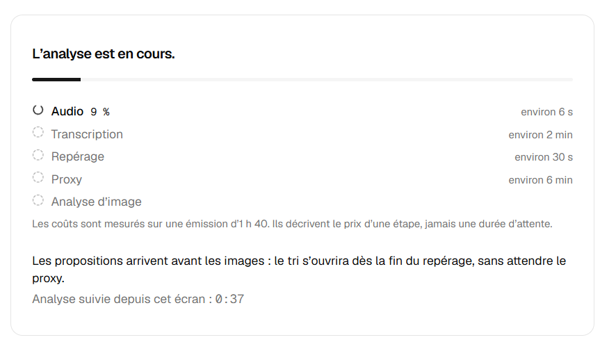
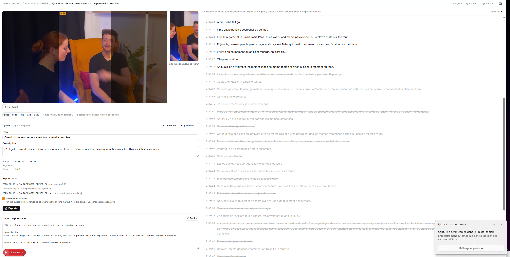
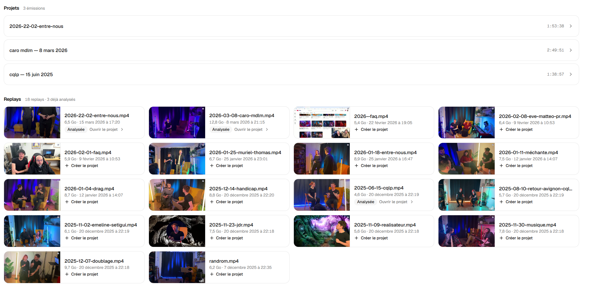

# Suite du projet `avolo-shorts`

Écrit le 18 août 2026, après une séance d’utilisation. **Presque tout a été
fait depuis**, et ce document n’est plus une liste de courses : c’est la trace du
retour d’usage qui a produit l’interface actuelle. Le code cite ses numéros de
section à plusieurs endroits, ils ne bougent donc pas.

État au 23 août 2026, vérifié section par section contre le commit `ceb921a`.

| Section | État |
|---|---|
| §1 bibliothèque unifiée, filtres, recherche, « Émission » | fait |
| §2.1 proxy dans la vue Émission | fait |
| §2.2 timeline des clips, survol, clic, chevauchements | fait, moins les plateformes publiées (§8) |
| §2.3 transcript de l’émission, retranscription, correction LLM | fait |
| §2.4 sélection multiple et publication en masse | l’interface est là ; les états par couple clip/plateforme n’ont aucune source (§8) |
| §3.1 → §3.6 écran de clip : fresque, aperçus, drawer, zones, export, publier | fait |
| §4.1 arrêter et reprendre une analyse | fait, annulation propagée jusqu’aux processus |
| §4.2 estimation proportionnée à la durée | fait, `src/core/phase.ts` |
| §5 staging WSL, cache TTL 8 h | fait, `src/server/steps/ingest.ts` |
| §6.1 → §6.3 Paramètres IA, repérage, hook | fait, sauf `glitch` et `scanline` exposés mais non rendus |
| §7 hook de début de clip | fait, y compris l’invalidation des rendus |
| §8 UI de publication préparée | fait au périmètre demandé — aucun connecteur, aucune table |
| §9 « publié, mais modifié depuis » | logique et badge écrits et testés, jamais alimentés (§8) |

Les trois réserves tiennent au même trou : **il n’existe ni table de publication
ni connecteur**, ce que le §8 assumait déjà comme hors de sa passe.

Ce que ce document n’a pas vu, parce qu’il a été écrit avant que tout ça
n’existe, c’est la hiérarchie qui en résulte : elle est reprise dans
`docs/superpowers/specs/2026-08-23-hierarchie-ui-design.md` et suivie par
l’issue #131.

---

Ce document rassemble les retours après utilisation de l’interface actuelle et les fonctionnalités à préparer pour les prochaines itérations.

L’objectif n’est pas seulement d’ajouter des fonctionnalités, mais de **revoir la hiérarchie de l’interface autour des usages réels**.

Un point de vocabulaire : dans l’interface utilisateur, utiliser désormais **Émission** plutôt que **Projet**. Le concept interne `project`, les routes `/projects/...` et les types backend peuvent rester tels quels pour le moment : inutile d’engager un refactoring purement lexical du backend.

---

# 1. Écran principal / Bibliothèque

## Problème actuel

L’écran distingue actuellement les **Projets** des **Replays**, alors qu’un projet n’est finalement que l’état de traitement d’un replay.

Cela crée une duplication visuelle : une même émission peut apparaître à la fois dans les projets et dans les replays.

La vue **Replays** me paraît être le meilleur modèle mental.

## Proposition

N’avoir qu’une seule bibliothèque d’émissions/replays.

Chaque replay est représenté par une carte unique, enrichie avec son état lorsqu’une analyse existe déjà.

États visuels possibles :

* non analysé ;
* analyse en cours ;
* analyse interrompue / en erreur ;
* analysé ;
* éventuellement « clips prêts » / « clips publiés » plus tard.

Les émissions déjà analysées doivent être immédiatement reconnaissables, par exemple avec :

* une couleur de bordure différente ;
* un fond pastel léger ;
* un badge d’état.

Cliquer sur :

* une émission non analysée → démarre son analyse ;
* une émission en cours → ouvre son suivi ;
* une émission déjà analysée → ouvre directement la vue Émission.

Ajouter au-dessus de la bibliothèque des filtres :

**Tous · À analyser · En cours · Analysés · Erreurs**

Le filtre « À analyser » n’est pas indispensable pour la première passe mais paraît plus cohérent que de cacher cet état uniquement derrière « Tous ».

Prévoir également une recherche par titre si la bibliothèque grossit.

---

# 2. Écran Émission

L’écran actuellement appelé « Projet » devient la **vue centrale d’une émission**.

Il ne doit plus être uniquement un écran de tri : une fois l’analyse terminée, c’est aussi l’endroit depuis lequel on comprend tout ce qui a été produit à partir de l’émission.

## 2.1 Aperçu de l’émission

Afficher directement le **proxy vidéo** dans cette vue.

Le lecteur doit permettre :

* lecture / pause ;
* scrub ;
* accès rapide à un timecode ;
* idéalement clic sur la timeline pour déplacer la lecture.

---

## 2.2 Timeline des clips

Sous le lecteur, afficher une timeline représentant toute la durée de l’émission.

Les intervalles correspondant aux clips conservés sont matérialisés par des blocs colorés.

Au survol d’un bloc, afficher :

* thumbnail ;
* titre du clip ;
* timecode début / fin ;
* durée ;
* état : montage / export / publication ;
* éventuellement les plateformes déjà publiées.

Au clic, ouvrir directement le clip correspondant.

À terme, la couleur du bloc peut refléter son état :

* clip à monter ;
* clip prêt ;
* exporté ;
* publié.

Il faut rester capable de comprendre lorsqu’il existe plusieurs clips qui se chevauchent.

La timeline devient ainsi à la fois :

* une représentation de ce qui a été extrait de l’émission ;
* un moyen rapide de naviguer entre les clips ;
* un indicateur de la couverture de l’émission.

---

## 2.3 Gestion du transcript

Le transcript est une propriété de l’émission, il doit donc également pouvoir être administré depuis cette vue.

Actions :

* **Voir / corriger le transcript**
* **Relancer la transcription**
* plus tard : **Corriger automatiquement avec un LLM**

Pour un transcript d’une émission entière, éviter une petite modale classique. Utiliser plutôt une grande modale / vue plein écran / drawer suffisamment large.

### Relancer la transcription

Action explicitement destructive : demander confirmation.

Une retranscription doit passer par le graphe de dépendances existant afin que les artefacts dépendants soient correctement marqués comme obsolètes.

Ne pas implémenter une logique parallèle d’invalidation dans l’UI.

### Correction manuelle

Permettre de corriger le texte tout en conservant autant que possible les timings des mots.

Les conséquences sur :

* le repérage ;
* les sous-titres ;
* les rendus déjà exportés

doivent être explicites et gérées par le graphe.

### Correction automatique

**Pas encore implémentée actuellement.**

Elle appartient à l’itération prévue de nettoyage/correction du transcript.

Quand elle sera ajoutée, elle devra utiliser le fournisseur LLM sélectionné dans les paramètres.

---

## 2.4 Sélection et publication en masse

La vue Émission doit permettre de sélectionner plusieurs clips.

Chaque clip possède une checkbox.

Une toolbar apparaît dès qu’au moins un clip est sélectionné :

**Publier X clips**

Workflow :

1. sélectionner les clips ;
2. cliquer sur **Publier** ;
3. choisir les plateformes ;
4. afficher un récapitulatif ;
5. confirmer ;
6. lancer les publications.

Plateformes :

* Instagram ;
* Facebook ;
* TikTok ;
* YouTube Shorts.

Respecter les capacités réelles de chaque plateforme : une plateforme indisponible ou non configurée reste visible mais désactivée avec la raison.

Pour chaque couple clip / plateforme, afficher ensuite l’état :

* en cours ;
* déposé ;
* publié ;
* échec.

Important : **« déposé » et « publié » restent deux états distincts**, notamment pour TikTok.

Un échec sur une plateforme ne doit jamais annuler les autres publications.

Un clip non exporté ne peut pas être publié. L’interface doit expliquer pourquoi plutôt que simplement désactiver silencieusement l’action.

---

# 3. Écran Clip

L’écran fonctionne aujourd’hui, mais sa hiérarchie ne correspond pas à la fréquence réelle des usages.

Le transcript occupe actuellement énormément d’espace alors que, dans la majorité des cas, le workflow consiste plutôt à :

1. vérifier le clip ;
2. vérifier/corriger le cadrage ;
3. ajuster éventuellement quelques informations ;
4. exporter/publier.

La modification fine dans le transcript est ponctuelle.

Il faut donc **repenser globalement la hiérarchie de cette page**.

---

## 3.1 Navigation entre clips

Les boutons « Clip précédent / Clip suivant » sont utiles, mais mal placés.

Les remplacer ou les compléter par une **bande horizontale de thumbnails tout en haut de l’écran**.

Cette fresque représente tous les clips gardés de l’émission.

Pour chaque clip :

* thumbnail ;
* numéro ou titre court ;
* état visuel ;
* clip courant clairement sélectionné.

La bande est scrollable horizontalement si nécessaire.

Un clic change directement de clip.

Cela permet immédiatement de comprendre :

> Je suis en train d’éditer le clip 4 parmi les 12 clips de cette émission.

---

## 3.2 Zone principale : previews

La preview source 16:9 et la preview verticale doivent avoir **exactement la même hauteur visuelle**.

La différence de ratio ne doit pas provoquer une différence de poids visuel entre les deux composants.

Les deux servent deux objectifs différents :

* source : comprendre le cadrage ;
* sortie : comprendre le résultat final.

Elles doivent être perçues comme deux vues équivalentes du même clip.

Sous cette zone viennent les réglages directement liés à l’image :

* ratio ;
* cadrage ;
* futur cadrage automatique / manuel ;
* branding ;
* hook.

---

## 3.3 Transcript en vue secondaire

Le transcript ne doit plus occuper en permanence la moitié de l’écran.

Ajouter une action explicite, par exemple :

**Modifier le montage**

ou

**Transcript**

qui ouvre un drawer/panneau dédié.

Ce panneau conserve toutes les possibilités actuelles :

* chercher ;
* déplacer la lecture en cliquant sur un mot ;
* retirer un passage ;
* étendre/réduire le clip ;
* restaurer un passage ;
* undo / redo.

L’objectif n’est **pas de supprimer les capacités du transcript**, mais de ne les afficher que lorsqu’on en a besoin.

Ce changement doit aussi être reflété dans la spec de parcours actuelle : le transcript n’est plus la surface visuelle principale de l’écran Clip mais un **outil d’édition avancée accessible à la demande**.

---

## 3.4 Informations éditoriales

Titre, description et futur hook doivent être regroupés dans une même zone logique.

Éviter de mélanger dans le même niveau visuel :

* timecodes techniques ;
* état de sauvegarde ;
* titre ;
* cadrage ;
* navigation ;
* publication.

On doit distinguer clairement :

**Contenu**

* titre ;
* description ;
* hook.

**Image**

* ratio ;
* cadrage ;
* branding.

**Montage**

* transcript / découpage.

**Livraison**

* export ;
* publication.

---

## 3.5 Export

Conserver le principe actuel : l’export appartient au clip et ne justifie pas un écran séparé.

Afficher clairement :

* formats produits ;
* état du rendu ;
* fichiers disponibles ;
* textes de publication ;
* éventuelles erreurs.

---

## 3.6 Publication depuis le clip

Ajouter un bouton principal :

**Publier**

Il ouvre la même modale de publication que celle utilisée pour la publication en masse depuis une émission.

La logique métier ne doit donc pas être dupliquée entre les deux écrans.

La modale permet :

* choix des plateformes ;
* affichage des plateformes indisponibles ;
* confirmation avant publication ;
* suivi des différents états.

Empêcher une nouvelle publication vers une plateforme déjà marquée `publié`, sauf action explicite de republication.

---

# 4. Écran Analyse

## 4.1 Pouvoir arrêter une analyse

Ajouter une action **Arrêter l’analyse**.

Je préfère « Arrêter » à « Pause » tant qu’il n’existe pas réellement de mécanisme permettant de suspendre puis reprendre exactement un processus.

Le comportement souhaité :

* arrêter le travail en cours ;
* conserver tous les artefacts déjà terminés ;
* permettre ensuite **Reprendre l’analyse** ;
* le graphe reprend à la première étape manquante.

Ne pas simuler un arrêt uniquement côté UI : l’annulation doit réellement être propagée aux processus concernés.

---

## 4.2 Estimation de durée adaptée à l’émission

Les durées affichées actuellement doivent tenir compte de la durée réelle de l’émission.

Une émission de 20 minutes ne doit pas afficher la même estimation qu’une émission de 2 h 30.

Utiliser les mesures réelles du projet comme référence et extrapoler en fonction :

* de la durée de la vidéo ;
* éventuellement de la taille du fichier pour la copie ;
* du nombre de fenêtres pour le repérage.

Éviter une fausse précision.

Préférer par exemple :

> environ 2–3 min

à :

> 2 min 17 s restantes

si nous n’avons pas suffisamment de mesures.

L’estimation pourra se raffiner avec les exécutions réelles enregistrées par l’application.

---

# 5. Backend / Pipeline — traitement sous WSL

L’étape audio censée être très rapide peut devenir extrêmement lente lorsqu’elle travaille directement sur un fichier situé hors du filesystem Linux de WSL.

Avant de commencer le traitement, si la source est extérieure à WSL :

1. copier/materialiser le fichier dans un espace de staging local WSL ;
2. effectuer le traitement depuis cette copie locale ;
3. réutiliser la copie pour les opérations suivantes qui peuvent en bénéficier.

Ne surtout pas provoquer des allers-retours répétés entre le filesystem Windows et WSL pendant ffmpeg.

## Cache temporaire

La copie locale est un cache de travail.

TTL : **8 heures**.

Prévoir :

* nettoyage best effort au démarrage et/ou après traitement ;
* nom déterministe permettant de réutiliser la même copie ;
* écriture atomique (`.partial` puis rename) ;
* ne pas copier deux fois simultanément la même source si deux traitements la demandent ;
* vérifier qu’une entrée de cache correspond toujours à la source courante avant de la réutiliser.

Le cache n’est jamais une source de vérité et peut être supprimé sans conséquence fonctionnelle.

---

# 6. Nouvelle vue Paramètres

Ajouter un écran global **Paramètres**.

L’objectif est d’éviter que les choix structurants continuent à vivre dans `.env` ou en constantes alors qu’ils deviennent des réglages produit.

Organiser l’écran en sections.

---

## 6.1 Intelligence artificielle

Permettre de choisir le fournisseur et le modèle utilisés pour chaque phase.

Fournisseurs :

* Gemini ;
* OpenAI ;
* Ollama local.

Au minimum :

### Repérage des clips

* fournisseur ;
* modèle.

### Correction du transcript

* fournisseur ;
* modèle.

Cette phase n’est pas encore implémentée mais l’interface et le modèle de configuration peuvent être préparés.

### Génération du hook

* fournisseur ;
* modèle.

Éventuellement plus tard, le même système pourra servir aux autres générations éditoriales.

La configuration doit être **par usage**, et non un unique « LLM de l’application » : il doit être possible d’utiliser par exemple Gemini pour le repérage et Ollama pour la correction du transcript.

Les secrets API restent gérés selon le mécanisme existant ; **ne jamais stocker une clé API brute dans la table de paramètres**.

Pour Ollama prévoir :

* URL du serveur ;
* nom du modèle.

Pour les fournisseurs cloud :

* modèle ;
* référence au secret existant.

Changer un réglage LLM ne doit pas automatiquement recalculer les émissions existantes. Un recalcul reste une action explicite.

---

## 6.2 Paramètres de repérage

Exposer dans l’interface les réglages backend introduits par la PR #64 :

* minutes par clip ;
* fenêtres examinées par clip ;
* nombre minimum de clips ;
* nombre minimum de fenêtres ;
* nombre maximum de clips (`0` = illimité).

Ajouter pour chaque réglage :

* libellé compréhensible ;
* courte explication ;
* valeur par défaut ;
* possibilité de restaurer la valeur par défaut.

Éviter de présenter uniquement les noms techniques des clés.

Idéalement afficher une petite estimation résultante :

> Pour une émission avec environ 90 min de parole : ~15 à 23 clips demandés.

Cela permet de comprendre immédiatement l’effet d’un réglage.

---

## 6.3 Hook

Ajouter une section de réglages globaux du hook.

Valeurs par défaut :

* activé / désactivé ;
* durée : **2 secondes** ;
* police ;
* taille ;
* position ;
* couleur du texte ;
* couleur / opacité du fond ;
* alignement ;
* effet d’apparition ;
* effet de disparition.

Transitions possibles initialement :

* aucune ;
* fade ;
* glitch ;
* scanline.

Éviter d’implémenter dix effets avant d’avoir validé visuellement les quatre premiers.

Ces paramètres sont les **valeurs par défaut**. Un clip peut ensuite les surcharger.

---

# 7. Nouvelle fonctionnalité : Hook de début de clip

Chaque clip peut disposer d’un texte court affiché dès le début de la vidéo.

Exemple :

> **Quand l’impro part beaucoup trop loin…**

L’objectif est de créer une accroche immédiatement visible dans le feed avant même que le spectateur comprenne le contexte.

## Génération

Le hook peut être :

* généré automatiquement par LLM ;
* modifié manuellement ;
* régénéré ;
* désactivé pour un clip.

Pour limiter les appels inutiles au LLM, **ne pas générer des hooks pour tous les candidats**.

Le faire uniquement pour les clips réellement gardés, idéalement au moment où ils entrent dans le workflow de montage ou à la demande.

Le modèle utilisé vient des Paramètres.

---

## Rendu

Par défaut :

* démarrage : `0s` ;
* durée : `2s` ;
* présence dès la première frame ;
* éventuellement transition d’entrée/sortie.

Le texte doit :

* respecter une safe-area adaptée au format vertical ;
* pouvoir revenir sur plusieurs lignes ;
* rester lisible sur le fond ;
* être prévisualisé directement dans la preview 9:16.

Réglages par clip :

* texte ;
* police ;
* taille ;
* position ;
* couleur du texte ;
* fond ;
* effet ;
* durée.

Prévoir un bouton **Réinitialiser avec les paramètres globaux**.

Toute modification du hook est une modification qui affecte le rendu : elle doit donc **invalider les fichiers exportés existants** de la même manière qu’un changement de cadrage ou de sous-titres.

---

# 8. Publication : préparer l’UI avant le backend

La publication doit être visible dès maintenant dans les écrans même si tous les connecteurs backend ne sont pas disponibles.

Cela permettra de construire l’interface autour du workflow final plutôt que d’avoir à la restructurer après coup.

La même primitive de publication doit être utilisée :

* depuis un clip ;
* depuis une sélection de clips d’une émission.

## États par plateforme

Toujours distinguer :

* `en_cours` ;
* `déposé` ;
* `publié` ;
* `échec`.

Une publication est indépendante pour chaque plateforme.

La modale doit également savoir afficher :

* non configuré ;
* indisponible ;
* audit requis.

Une publication est publique et potentiellement irréversible : confirmation obligatoire avant lancement.

---

# 9. Cohérence des états après publication

Prévoir dès maintenant un cas qui arrivera rapidement :

1. un clip est exporté et publié ;
2. on revient dessus ;
3. on modifie le montage, le cadrage ou le hook.

La publication distante ne disparaît évidemment pas.

L’UI doit donc pouvoir distinguer :

> Instagram — publié

de :

> Instagram — publié, mais le clip local a été modifié depuis

Cela évite de laisser croire que la version actuellement affichée dans l’éditeur correspond toujours à celle visible sur le réseau.

La republication reste une action volontaire.

---

# 10. Ordre de réalisation proposé

## UI / UX en premier

1. unifier Projets et Replays dans la bibliothèque ;
2. renommer Projet → Émission côté interface ;
3. refondre la hiérarchie de l’écran Clip ;
4. ajouter la fresque de navigation entre clips ;
5. mettre le transcript en drawer ;
6. ajouter proxy + timeline dans la vue Émission ;
7. ajouter l’écran Paramètres ;
8. préparer les composants UI de publication.

## Pipeline

9. staging WSL avec TTL 8 h ;
10. véritable arrêt/reprise d’une analyse ;
11. estimation des temps selon la durée.

## Features

12. hook + preview + rendu ;
13. provider abstraction Gemini / OpenAI / Ollama ;
14. correction LLM du transcript ;
15. publication Meta ;
16. TikTok / YouTube selon les contraintes et audits déjà documentés.

---

# 11. Points de vigilance

* Ne pas renommer tout le domaine backend `project` uniquement pour suivre le nouveau vocabulaire UI.
* Toute modification d’un paramètre global ne doit pas silencieusement recalculer des émissions existantes.
* Toute propriété consommée par le rendu — notamment le hook — doit participer à l’invalidation du rendu.
* Une « pause » qui tue seulement l’affichage mais laisse ffmpeg/Whisper tourner n’est pas une pause.
* La publication en masse doit réutiliser exactement la même logique que la publication d’un clip.
* Un clip modifié après sa publication doit rester explicitement identifié comme tel.
* Mettre à jour les specs existantes lorsque cette refonte est implémentée, en particulier la place du transcript dans l’écran Clip et la structure de la bibliothèque.

## Images

**Captures du 18 août 2026 : elles montrent l’état d’alors, pas l’écran
d’aujourd’hui.** Elles sont gardées parce qu’elles sont le diagnostic qui a fait
écrire ce document — la bibliothèque y sépare encore « Projets » et « Replays »,
le transcript y occupe encore la moitié de l’écran de clip, et le panneau
d’analyse y donne des durées qui ne dépendent pas de l’émission.

Vue analyse : 

Vue clip : 

Vue bibliothèque : 